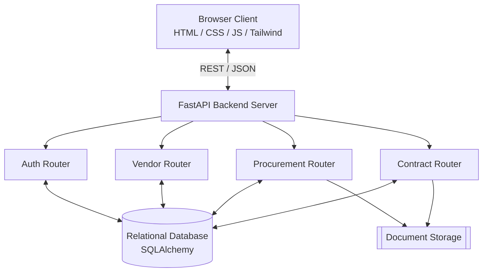
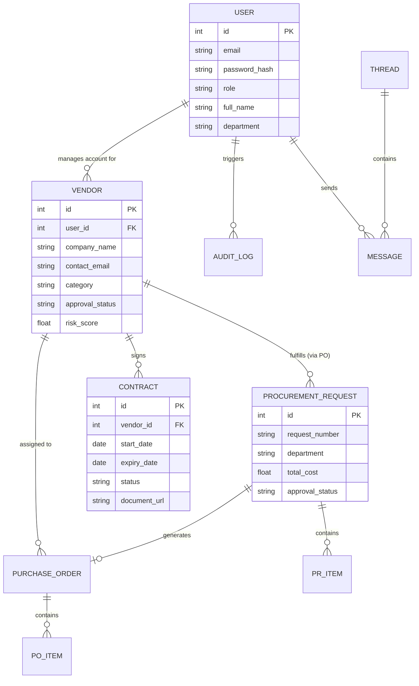

# VendorIntel: Complete Milestone Documentation

This document serves as the comprehensive documentation for the **VendorIntel** platform, encompassing system requirements, architectural design, database schemas, and module breakdowns for Milestones 1 and 2.

## 1. System Requirements (Milestone 1)

### 1.1 Project Objectives
VendorIntel is a state-of-the-art Vendor Reliability Intelligence Platform designed to streamline the procurement lifecycle, automate vendor risk assessment, and provide real-time telemetry on vendor performance and compliance. 

### 1.2 Functional Requirements
- **Authentication & Authorization**: Secure JWT-based login, role-based access control (Admin, Procurement Manager, Vendor, Auditor, Supply Chain Manager, Finance Officer).
- **Vendor Management**: End-to-end lifecycle management including registration, approval workflows, risk matrix analysis, and performance reviews.
- **Procurement Request (PR) Engine**: Internal workflows for generating PRs, dynamic line-item calculation, and multi-stage managerial approvals based on cost thresholds.
- **Purchase Order (PO) Processing**: Conversion of PRs to POs, vendor fulfillment tracking (Shipped, Delivered), and automated invoicing.
- **Contract Management**: Centralized repository for vendor agreements, tracking start/expiry dates, compliance flags, and automated renewal reminders.
- **Communication Module**: Unified thread-based communication allowing internal stakeholders to chat directly with vendors regarding specific POs, PRs, or Contracts.

### 1.3 Non-Functional Requirements
- **Scalability**: Capable of handling concurrent vendor sessions and large document uploads using an asynchronous FastAPI backend.
- **Security**: Robust `bcrypt` password hashing, encrypted JWT payloads, and strict endpoint authorization policies.
- **UI/UX**: Premium, responsive, glass-morphism aesthetic ensuring a seamless experience across desktop and mobile viewing (Dark/Light mode support).

---

## 2. System Architecture

The application follows a modern decoupled client-server architecture.
- **Frontend**: Vanilla HTML/TailwindCSS/JavaScript communicating asynchronously via `fetch`.
- **Backend**: Python 3 (FastAPI) serving RESTful APIs.
- **Database**: Relational Database (SQLAlchemy ORM - SQLite for prototyping, MySQL ready).



---

## 3. Use Case Diagrams

This diagram illustrates how different user roles interact with the system's core modules.

```mermaid
usecaseDiagram
    actor Admin
    actor "Procurement Mgr" as ProcMgr
    actor Vendor
    actor Auditor

    usecase "Manage Users & Roles" as UC1
    usecase "Approve/Reject Vendors" as UC2
    usecase "Create & Approve PRs" as UC3
    usecase "Generate POs" as UC4
    usecase "Submit Invoices/Delivery" as UC5
    usecase "Manage Contracts" as UC6
    usecase "View Risk Matrix & Audit" as UC7

    Admin --> UC1
    Admin --> UC2

    ProcMgr --> UC2
    ProcMgr --> UC3
    ProcMgr --> UC4
    ProcMgr --> UC6
    ProcMgr --> UC7

    Vendor --> UC5
    
    Auditor --> UC7
```

---

## 4. Entity-Relationship (ER) Diagram

The database is highly normalized to support complex relationships between Users, Vendors, Requests, and Orders.



---

## 5. Milestone 2 Module Breakdown

### 5.1 Vendor Management Module
- **Endpoints**: `/api/vendors`, `/api/vendors/{id}`
- **Features**: Complete CRUD operations, Vendor Categories, Search & Filter capabilities, and strict Approval Workflows (Pending -> Under Review -> Approved/Rejected).
- **UI Element**: `vendor_dashboard.html`, `admin_dashboard.html`

### 5.2 Procurement Request (PR) Module
- **Endpoints**: `/api/procurement-requests`, `/api/procurement-requests/{id}`
- **Features**: Dynamic Line Item Calculations, Department Selection, and Multi-stage Approval Workflow (Pending -> Approved -> Ordered -> Delivered -> Completed/Cancelled).
- **UI Element**: `procurement_requests.html`

### 5.3 Purchase Order (PO) Module
- **Endpoints**: `/api/purchase-orders` (Integration Planned)
- **Features**: Converts approved PRs to formal POs. Supports Vendor updates (Shipped, Partial Delivery, Delivered) and Invoice/Receipt document uploads.
- **UI Element**: `purchase_orders.html` (Planned/In-progress)

### 5.4 Contract Management
- **Endpoints**: `/api/contracts`, `/api/contracts/{id}/upload`
- **Features**: Vendor assignment, Document Uploading, Expiry Tracking with Compliance Flags, and 30/60/90 Day Renewal Notices.
- **UI Element**: `contracts.html`

### 5.5 Communication Module
- **Endpoints**: `/api/threads`, `/api/threads/{entity_type}/{entity_id}`
- **Features**: Contextual thread-based messaging tying conversations directly to a specific Vendor, Contract, PR, or PO. Maintains permanent audit logs of correspondence.
- **UI Element**: Reusable Chat Modal integrated across all dashboards.
