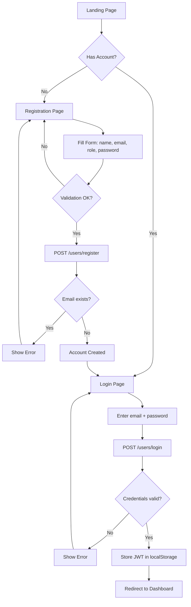
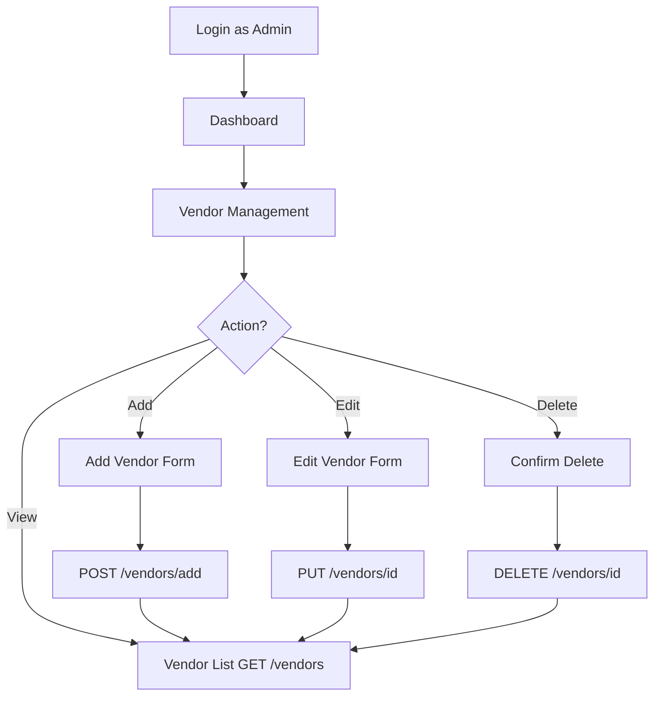
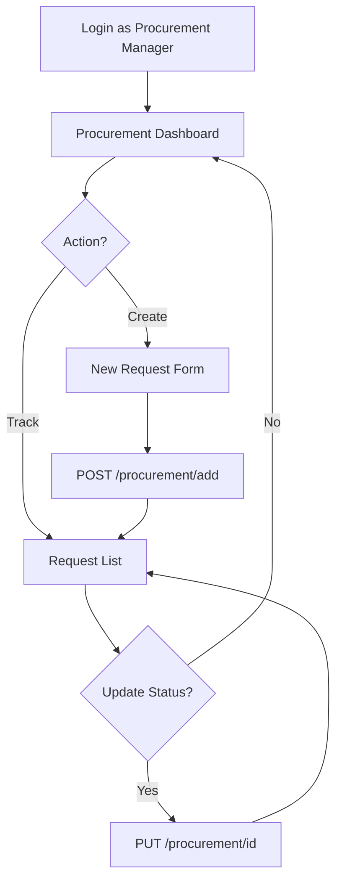
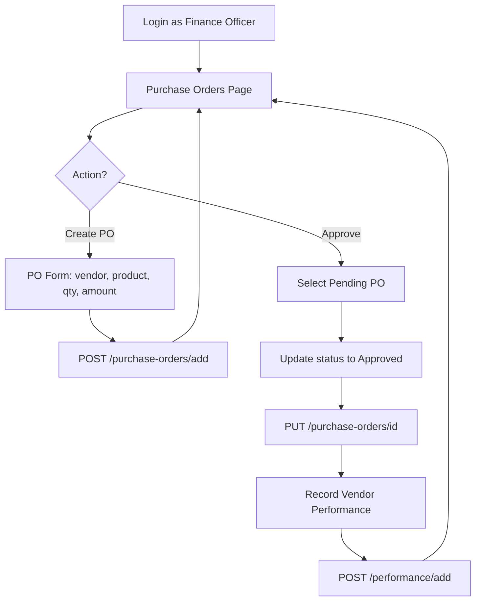
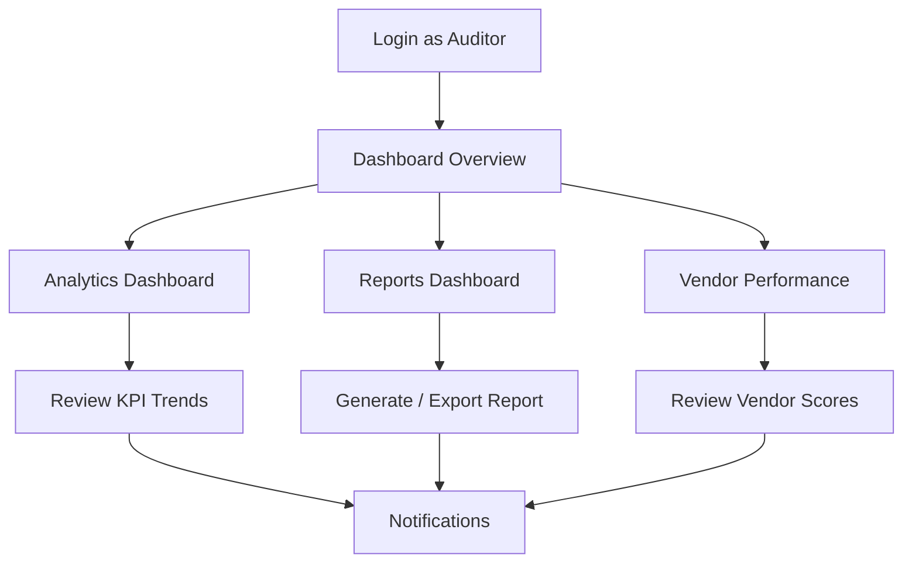
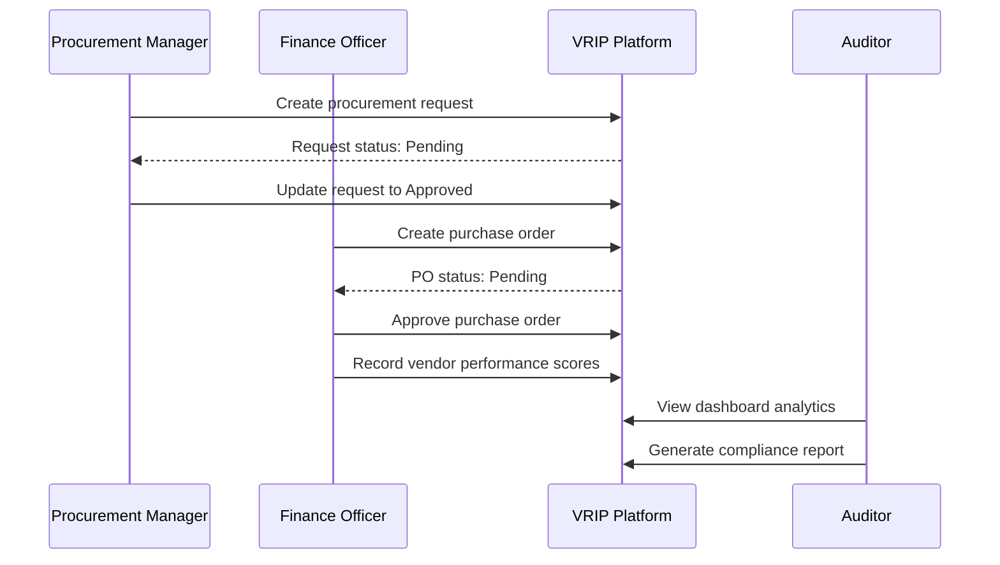

# User Flow Diagrams

## 1. Authentication Flow

---

## 2. Admin — Vendor Management Flow

---

## 3. Procurement Manager Flow

---

## 4. Finance Officer — Purchase Order Flow

---

## 5. Auditor — Review Flow

---

## 6. End-to-End Procurement Lifecycle

