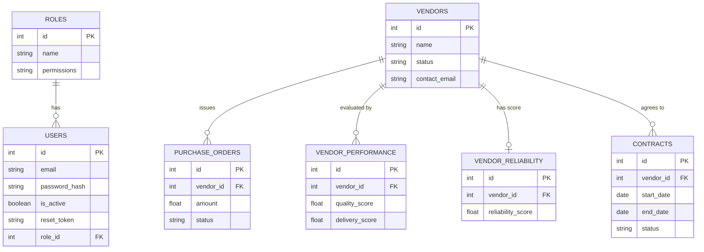

# Entity-Relationship Diagram

This diagram represents the core database schema for Milestone 1, covering all 7 required entities and their relationships.

```mermaid
erDiagram
    ROLES {
        int id PK
        string name
        string permissions
    }
    
    USERS {
        int id PK
        string email
        string password_hash
        boolean is_active
        string reset_token
        int role_id FK
    }
    
    VENDORS {
        int id PK
        string name
        string status
        string contact_email
    }
    
    PURCHASE_ORDERS {
        int id PK
        int vendor_id FK
        float amount
        string status
    }
    
    VENDOR_PERFORMANCE {
        int id PK
        int vendor_id FK
        float quality_score
        float delivery_score
    }
    
    VENDOR_RELIABILITY {
        int id PK
        int vendor_id FK
        float reliability_score
    }
    
    CONTRACTS {
        int id PK
        int vendor_id FK
        date start_date
        date end_date
        string status
    }

    ROLES ||--o{ USERS : "has"
    VENDORS ||--o{ PURCHASE_ORDERS : "issues"
    VENDORS ||--o{ VENDOR_PERFORMANCE : "evaluated by"
    VENDORS ||--o| VENDOR_RELIABILITY : "has score"
    VENDORS ||--o{ CONTRACTS : "agrees to"
```
